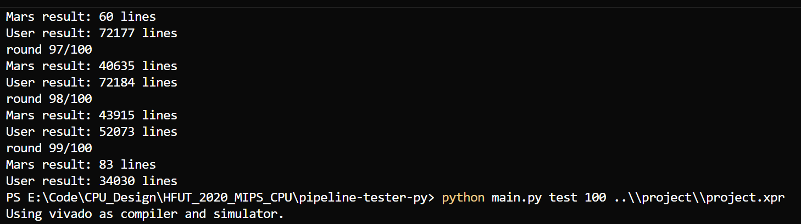

## 五级流水线 MIPS CPU 实验报告

### 一、实验概述

本实验根据课程给出的《50 条指令流水线 CPU 设计》说明与 `MultiplicationDivisionUnit.sv` 下发文件，设计并实现了一个**五级流水线 MIPS CPU**，支持实验要求中的 50 条指令及 `syscall`。CPU 采用经典 **IF / ID / EX / MEM / WB** 五级流水结构，通过**旁路转发（Forwarding）**、**流水线阻塞（Stalling）**、**分支延迟槽（Delay Slot）**以及**多周期乘除法单元阻塞**等机制，正确处理数据冒险和控制冒险，并支持**字节/半字的非对齐访存**。

本设计使用 Verilog/SystemVerilog 实现，顶层模块为 `TopLevel`，核心流水线模块为 `MIPS`，在 Vivado 仿真环境下配合课程提供的 `mips_tb.v` 与自动测试脚本进行验证，并使用 `pipeline-tester-py` 工具与 MARS 模拟器输出日志对比，结果一致。

---

### 二、实验要求与指令集支持

#### 2.1 实验要求总结

根据《五级流水线 MIPS CPU 实验报告.md》中的实验指南，本实验需满足：

- **指令集**：  
  - **ALU 指令**：ADD / ADDU / SUB / SUBU / SLL / SRL / SRA / SLLV / SRLV / SRAV / AND / OR / XOR / NOR / SLT / SLTU  
  - **立即数类**：LUI, ADDI / ADDIU / ANDI / ORI / XORI / SLTI / SLTIU  
  - **乘除法类**：MULT / MULTU / DIV / DIVU / MFHI / MTHI / MFLO / MTLO  
  - **分支指令**：BEQ / BNE / BLEZ / BGTZ / BGEZ / BLTZ  
  - **跳转指令**：J / JAL / JR / JALR  
  - **访存指令**：LB / LBU / LH / LHU / LW / SB / SH / SW  
  - **syscall**：至少正确支持功能号 10（退出）和 1（整数输出）
- **流水线结构**：五级流水，支持分支延迟槽
- **MDU（乘除法器）**：使用给定 `MultiplicationDivisionUnit.sv`，多周期、带 `busy` 与 `start` 控制
- **非对齐访存**：在 MEM 级完成对字节 / 半字的对齐和扩展处理，写内存视为对所在字的写

#### 2.2 指令支持情况

在 `Ctrl` 主控制模块中，对应 Op / Funct 的编码可见本设计支持了实验说明中所有指令，包括：

- **R 型指令**：ADD/ADDU/SUB/SUBU/SLT/SLTU/SLL/SLLV/SRL/SRLV/SRA/SRAV/AND/OR/XOR/NOR/MULT/MULTU/DIV/DIVU/MFHI/MFLO/MTHI/MTLO/JR/JALR/SYSCALL
- **I/J 型指令**：LUI、所有要求的立即数 ALU 指令、分支指令、跳转 J/JAL，以及 LB/LBU/LH/LHU/LW/SB/SH/SW

控制信号中专门有 `IsLbSbD`、`IsLhShD`、`IsUnsignedD` 等标志配合 `DMExt`、`BECtrl` 模块处理不同宽度与有符号/无符号访存。

---

### 三、总体设计与模块划分

#### 3.1 顶层与 CPU 核心

- **`TopLevel`**：实验顶层，仅实例化 `MIPS dut (clk, rst)`，便于与测试平台对接。
- **`MIPS` 模块**：包含整个五级流水线数据通路与控制通路，是本设计的核心。
  - `PC`：程序计数器，支持 `StallF` 阻塞与 `IsJBrD` 跳转。
  - `IM_2k`：指令存储器（只读）。
  - 五级流水寄存器：`RegD`、`RegE`、`RegM`、`RegW`。
  - 运算与控制模块：`Ctrl`、`ALU`、`Comp`、`Ext`、`NPC`、`Hazard`、`StartCtrl`。
  - 访存模块：`DM_4k`（数据存储器）、`BECtrl`、`DMExt`。
  - 乘除法单元：`MultiplicationDivisionUnit`（下发文件），在 EX 级使用。
  - 寄存器文件：`RegFile`，支持写回日志输出和给 `syscall` 使用的 `$v0` / `$a0` 读取。

#### 3.2 五级流水结构

- **IF 级**：
  - 组件：`PC`、`IM_2k`。
  - 功能：根据 `IsJBrD` 和 `NPCD` 生成下一个 PC；若 `StallF` 为 1，PC 保持不变。
- **ID 级**：
  - 组件：`RegD`、`Ctrl`、`RegFile`、`Comp`、`Ext`、`NPC`、ID 级旁路 MUX 等。
  - 功能：
    - 指令译码，生成控制信号。
    - 从寄存器文件读源操作数，并利用 `ForwardAD` / `ForwardBD` 对分支/跳转指令进行转发。
    - `Comp` 根据 `CompOpD` 完成分支比较。
    - `NPC` 计算分支 / 跳转目标地址以及 `IsJBrD` 信号。
- **EX 级**：
  - 组件：`RegE`、`ALU`、`StartCtrl`、乘除法单元操作选择逻辑、`MultiplicationDivisionUnit`。
  - 功能：
    - 使用 `ForwardAE` / `ForwardBE` 从 MEM/WB 阶段转发操作数。
    - 通过 `ALUSrcE`、`IsShamtE` 选择立即数、移位量、HI/LO 等不同来源作为 ALU/MDU 操作数。
    - 对乘除法指令生成相应 MDU 操作（`MDU_START_*` / `MDU_WRITE_*` / `MDU_READ_*`）。
- **MEM 级**：
  - 组件：`RegM`、`BECtrl`、`DM_4k`。
  - 功能：
    - 使用 `BECtrl` 根据地址低两位和指令类型生成字节使能 `BEOutM`。
    - 通过 `ForwardM` 实现写内存数据的旁路（存储指令写入值来自 WB 级结果时）。
    - 计算并输出写内存日志（由 `mips_tb` 完成）。
- **WB 级**：
  - 组件：`RegW`、`DMExt`、写回多路选择器。
  - 功能：
    - `DMExt` 根据 `BEOutW` 与 `IsUnsignedW` 对从数据存储器读出的 32 位结果进行符号/零扩展，得到正确的字/半字/字节数据。
    - `ResultW` 通过多路选择器在 ALU 结果 / load 结果 / PC+8（用于 JAL/JALR 写 $31）中选择。

---

### 四、流水线竞争处理

#### 4.1 数据冒险与旁路转发

本设计中的数据旁路由 `Hazard` 模块统一生成控制信号：

- **ID 阶段分支/跳转的转发**：  
  - `ForwardAD` / `ForwardBD`：
    - `00`：寄存器文件读值
    - `01`：来自 MEM 阶段 ALU 结果（`ALUOutM`）
    - `10`：来自 WB 阶段写回数据（`ResultW`）
    - `11`：来自 MEM 阶段 PC+8（用于 JAL/JALR 写回 $31）
- **EX 阶段 ALU 操作数转发**：
  - `ForwardAE` / `ForwardBE`：
    - `00`：来自 ID/EX 寄存器
    - `01`：来自 MEM 阶段 ALU 结果
    - `10`：来自 WB 阶段写回数据
- **MEM 阶段存储数据转发**：
  - `ForwardM`：
    - 0：使用 EX 级传下来的写数据
    - 1：使用 WB 级写回数据（ResultW），解决 `sw` 等指令写数据的 RAW 冒险

**寄存器 $0 特殊处理**：转发判断中都要求 `WriteRegM/W != 0`，避免对 $0 进行无意义的转发。

#### 4.2 Load-Use 冒险与阻塞

`Hazard` 模块中通过 `UseRsD/UseRtD/UseRsE/UseRtE` 组合 `OpD` / `ALUSrcD` 判定各阶段寄存器使用情况，形成统一的冒险判断：

- **Load-Use 冒险**：  
  当 ID/EX 或 ID/MEM 存在对同一寄存器的读写依赖，且上游指令为 `MemToRegE/M`（load）时，将 `OtherHazards` 置 1。
- **乘除法器冒险**：  
  若 ID 阶段有乘除/HI/LO 相关（`IsMdD`），且 EX 阶段 MDU 处于 `BusyE` 或正在 `StartE`，同样认为存在冒险。

`FlushE` 由 `OtherHazards` 直接给出，`StallF = StallD = FlushE`。当 `FlushE=1` 时：

- IF/ID 级保持当前值（插入气泡）
- ID/EX 寄存器被清零（将 EX 级指令冲掉）

#### 4.3 分支延迟槽与控制冒险

实验要求支持 **分支延迟槽**。本设计的要点：

- 在 ID 级通过 `NPC` 模块计算分支/跳转目标地址，与 PC+4 一起决定 `NPCD`。
- **延迟槽语义**：  
  当 ID 级为分支或跳转指令时，EX 级保存的是“延迟槽指令”，必须执行一次，不应被 Flush 掉。  
  因此 `Hazard` 中的 `FlushE` 逻辑只针对真正的 Load-Use / MDU 冒险，而不会因为分支本身清除 EX 级延迟槽指令。
- `NPC` 中：
  - J/JAL：`PCNext = {PCPlus4[31:28], Imm26, 2'b00}`
  - JR/JALR：`PCNext = 寄存器值（通过 ForwardAD 转发）`
  - Branch：满足条件时 `PCNext = PCPlus4 + offset`，否则为 `PCPlus4 + 4`

---

### 五、乘除法单元设计与集成

#### 5.1 乘除法单元实现

`MultiplicationDivisionUnit.sv` 为课程下发的多周期 MDU，实现要点：

- **操作类型**：`mdu_operation_t` 枚举，包括读取 HI/LO、写 HI/LO，以及四种乘除起始操作。
- **多周期执行**：
  - 乘法：`MUL_DELAY_CYCLES = 5`
  - 除法：`DIV_DELAY_CYCLES = 10`
  - 内部使用 `remainingCycleCount` 计数，倒计时到 0 时更新 HI/LO
- **除零行为**：除数为 0 时不修改 HI/LO，保持与 MARS 行为一致。

#### 5.2 EX 级集成与控制

在 `MIPS` 模块中：

- 使用 `StartCtrl` 根据指令类型产生 `StartD`，在 EX 级经流水寄存器变为 `StartE`。
- 在 EX 级 combinational 逻辑中，根据 `HiLoWriteE`、`StartE`、`MdOpE`、`ALUSrcE` 选择当前 MDU 操作：
  - `HiLoWriteE=1`：MTHI/MTLO -> 写 HI/LO
  - `StartE=1`：MULT/MULTU/DIV/DIVU -> 对应 `MDU_START_*`
  - 否则：若 ALUSrcE 选择 HI/LO，执行 `MDU_READ_HI/LO`
- `MultiplicationDivisionUnit` 的 `busy` 信号反馈给 `Hazard` 的 `BusyE`，通过 `IsMdD && (BusyE || StartE)` 实现**MDU 忙时的流水线阻塞**，保证 MULT/DIV 结果在 MFHI/MFLO 读取前已经准备好。

---

### 六、非对齐访存与 DM 扩展

#### 6.1 Byte Enable 生成（`BECtrl`）

在 MEM 级，`BECtrl` 根据 `ALUOutM[1:0]`（地址低两位）与 `IsLbSbM` / `IsLhShM` 生成 4 位字节使能 `BEOutM`，例如：

- 字节访问：只使能对应的一个字节 `0001/0010/0100/1000`
- 半字访问：使能相邻两个字节 `0011/1100`
- 字访问：`1111`

写内存时，`DM_4k` 按照 `BEOutM` 将写入视为对整个 32 位字的一次写入，符合实验“非对齐写按字写”的要求。

#### 6.2 Load 扩展（`DMExt`）

在 WB 级，`DMExt` 根据 `BEOutW` 与 `IsUnsignedW` 对从数据存储器读出的 32 位数据进行扩展：

- **无符号 load**：高位补 0
- **有符号 load**：高位做符号扩展

从而支持 LB/LBU/LH/LHU/LW 对应的结果格式，保证写回的数据与 MARS 一致。

---

### 七、Syscall 设计

#### 7.1 寄存器文件与数据通路

`RegFile` 额外输出 `$v0` 和 `$a0` 的值：

- `V0DataRaw`：寄存器 2（$v0）
- `A0DataRaw`：寄存器 4（$a0）

同时支持**写回旁路到读取端口**，保证写回同一个周期读取的值为最新值，满足 syscall 对寄存器读取的及时性。

#### 7.2 Syscall 控制

在 `Ctrl` 中，当 Funct 为 `SYSCALL` 时置 `IsSyscallD`，流水传递到 WB 阶段的 `IsSyscallW`。在 `MIPS` 模块的时序块中：

- 若 `IsSyscallW` 为 1 且未复位：
  - 当 `$v0 == 10`：执行 **syscall 10**，调用 `$finish` 结束仿真。
  - 当 `$v0 == 1`：执行 **syscall 1**，调用 `$fwrite` 输出 `$a0` 的有符号整数值到日志。

这与实验说明中“只需要支持整数输出与退出 syscall”一致。

---

### 八、测试与验证

#### 8.1 测试环境

- 仿真工具：Vivado 2018.3 自带仿真器（xsim），配合课程提供的 `mips_tb.v`。
- 自动测试框架：`pipeline-tester-py` 目录下脚本（`main.py`, `run_asm.ps1`, `run_all_asms.ps1` 等）。
- 参考模拟器：MARS（带 `Mars.jar`，开启延迟分支模式）。

#### 8.2 测试程序

- **基础功能测试**：使用 `TESTBENCH` 目录中的若干 `.s` / `.data` 文件（如 `code.s`、`hazard_*.s`、`forward_1.s` 等）检查指令解码、转发与分支延迟槽。
- **实验框架测试**：在 `pipeline-tester-py/mips-asm-test/` 目录下：
  - 官方示例程序：`add-*.asm`、`gcd-softmul.asm` / `gcd-hardmul.asm`、`lfsr.asm`、`pointer-chasing.asm`、`floyd.asm` 等。
  - **随机测试程序**：`random-asms` 目录下大量 `test_xx.asm`，由提供的生成器自动生成，用于覆盖各种指令组合与冒险情况。
- `pipeline-tester-py/test.asm`用于单步验证寄存器写回和访存行为，与 MARS 输出逐条比对。

**测试结果**：在所使用的官方测试集mips-asm-test与百次级别随机测试集中，本设计的日志输出与 MARS 完全一致，说明指令执行顺序、分支延迟槽、旁路与阻塞行为均与参考实现匹配。

### 九、总结与体会

- 本设计在**控制信号设计和统一转发/冒险逻辑**上采用了高度模块化的方式：`Ctrl` 只负责根据 Op/Funct 生成控制字段，`Hazard` 统一处理各种数据冒险与 MDU 冒险，易于理解和扩展。
- 通过在 **MEM 级完成非对齐访存处理**（`BECtrl` + `DMExt`），使得 WB 级只需选择写回来源，简化了数据通路，也便于旁路逻辑统一考虑 `ResultW`。
- 为了满足**分支延迟槽**语义，需要在 Flush/ Stall 条件中格外小心，确保延迟槽指令不会被错误清除，这是本实验中比较容易掉坑的地方。
- 多周期乘除法单元的引入，使得流水线不再是单周期“规整”结构，必须通过 `Busy` 和 `Start` 信号来协调 EX 级与其他级的进度，这一过程加深了对“功能单元忙导致结构/数据冒险”的理解。

总体而言，本次实验完成了五级流水线 MIPS CPU 所需的指令集与冒险处理机制，并通过自动化测试与 MARS 对比验证了设计的正确性，对流水线 CPU 的结构与实现细节有了更系统和深入的认识。